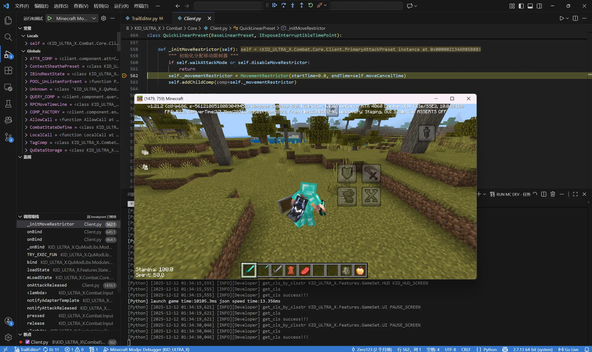

# MCDevTool
适用于**网易我的世界**的开发者工具包，提供创建测试世界、加载用户Mod等功能，方便开发者在脱离**mcs编辑器**的环境下离线测试Mod。



## 配置mcdk
您可以将**mcdk**添加到环境变量Path中，也可以直接放置在本地项目工作区以便命令搜索。

> vscode[插件](https://marketplace.visualstudio.com/items?itemName=dofes.mcdev-tools)现已经上线，可直接使用插件一站式开发，无需额外配置。

## 在vscode中使用
您可以在**vscode**中配置任务以便直接运行**mcdk**，例如：

```jsonc
// .vscode/tasks.json
{
    "version": "2.0.0",
    "tasks": [
        {
            // 普通启动模式（根据配置文件，默认自动进入存档）
            "label": "RUN MC DEV",
            "type": "shell",
            "command": "cmd /c mcdk",
            "presentation": {
                "reveal": "always",
                "panel": "shared"
            },
            "problemMatcher": [
                "$python"
            ]
        },
        {
            // 子进程启动模式（必定不会自动进入存档），用于自测联机调试
            "label": "RUN MC SUB DEV",
            "type": "shell",
            "command": "cmd /c mcdk",
            "options": {
                "env": {
                    // 传递环境变量控制mcdk行为
                    "MCDEV_AUTO_JOIN_GAME": "0",
                    "MCDEV_IS_SUBPROCESS_MODE": "1"
                }
            },
            "presentation": {
                "reveal": "always",
                "panel": "shared"
            },
            "problemMatcher": [
                "$python"
            ]
        }
    ]
}
```

## vscode断点调试
您可以通过配置**launch.json**以便在**vscode**中调试Mod代码，例如：

```jsonc
// .vscode/launch.json
// 注：断点支持依赖mcdbg后端，需要在mcdev.json文件中配置启用，另见debugger/README.md
{
    "version": "0.2.0",
    "configurations": [
        {
            // 可通过F5快捷键启动调试器附加
            "name": "Minecraft Modpc Debugger",
            "type": "debugpy",
            "request": "attach",
            "connect": {
                "host": "localhost",
                "port": 5632
            },
            "pathMappings": [
                {
                    "localRoot": "${workspaceFolder}",
                    "remoteRoot": "${workspaceFolder}"
                }
            ],
            "justMyCode": false
        }
    ]
}
```

## 在pycharm中使用

1. 点击菜单栏中的 `Run → Edit Configurations`
2. 打开`创建 Run Configuration`
3. 创建新的配置项
4. 配置`Shell Script`执行`mcdk`

## 在pycharm中调试

> 注：mcdbg后端基于微软的`DAP`协议，**pycharm**仅**专业版**支持`DAP`远程调试，社区版用户请使用**vscode**进行断点调试。

相关参考文档：

- [远程调试配置指南](https://www.jetbrains.com.cn/help/pycharm/remote-debugging-with-product.html)
- [附加到DAP](https://www.jetbrains.com/zh-cn/help/pycharm/run-debug-configuration-attach-to-dap.html)


## mcdev.json 配置参数
MCDEV配置文件，若不存在字段将以此处默认值为基准。
```jsonc
{
    // 首次运行将会自动生成 .mcdev.json 文件
    // 用于包含需要加载的MOD目录(默认值) 允许相对路径和绝对路径(相对路径以工作区为基准)
    "included_mod_dirs": [
        "./"   // 可以使用 {"path": "./", "hot_reload": true} 控制包含的目录是否参与热更新检测
    ],
    // 指定游戏exe路径(string)
    "game_executable_path": "",
    // 生成的世界种子 若为null则随机生成(null / int)
    "world_seed": null,
    // 是否在启动时重置并新生成世界
    "reset_world": false,
    // 用于渲染的世界名称 (string)
    "world_name": "MC_DEV_WORLD",
    // 目录存档名(ASCII STRING)
    "world_folder_name": "MC_DEV_WORLD",
    // 是否自动进入游戏存档
    "auto_join_game": true,
    // 是否附加调试MOD(boolean)，若启用将在生成的世界中包含热更新脚本(R键触发检测)并重定向输出流使其附加[Python]前缀可供筛选搜索。
    "include_debug_mod": true,
    // 是否自动热更新MOD
    "auto_hot_reload_mods": true,
    // 生成的世界类型(0.旧版有限世界 1.无限世界 2.超平坦) (int)
    "world_type": 1,
    // 游戏模式(0.生存 1.创造 2.冒险) (int)
    "game_mode": 1,
    // 是否启用作弊(boolean)
    "enable_cheats": true,
    // 是否死亡不掉落(boolean)
    "keep_inventory": true,
    // 天气是否自然更替
    "do_weather_cycle": true,
    // 昼夜是否自然更替
    "do_daylight_cycle": true,
    // 实验性玩法配置
    "experiment_options": {
        // 数据驱动生物群系
        "data_driven_biomes": false,
        // 其他数据型驱动功能
        "data_driven_items": false,
        // 实验性Molang特性
        "experimental_molang_features": false
    },
    // 用户自定义名称(默认"developer")
    "user_name": "developer",
    // 用户自定义皮肤信息（默认缺失字段自动生成）
    "skin_info": {
        "slim": false,
        "skin": "完整贴图路径.png"
    },
    // MODPC调试器配置（依赖mcdbg后端，请确保配置在环境变量/当前工作区）
    "modpc_debugger": {
        // 注：若使用插件一站式解决方案则通常不需要启用此选项，由插件自动管理
        "enabled": false,   // 默认不启用
        "port": 5632        // 端口号（需要在vscode配置中同步）
    },
    // 自定义debug参数(选填可缺失)
    "debug_options": {
        // 键码查阅：https://mc.163.com/dev/mcmanual/mc-dev/mcdocs/1-ModAPI-beta/%E6%9E%9A%E4%B8%BE%E5%80%BC/KeyBoardType.html
        // 绑定热更新快捷键
        "reload_key": "82",
        // 绑定重载世界快捷键
        "reload_world_key": "",
        // 绑定重载Addon快捷键
        "reload_addon_key": "",
        // 绑定重载着色器快捷键
        "reload_shaders_key": "",
        // 是否在全体UI界面都触发热更新快捷键（默认false仅HUD界面）
        "reload_key_global": false
    },
    // 窗口样式（美化类？）
    "window_style": {
        // 悬浮置顶
        "always_on_top": false,
        // 隐藏标题栏
        "hide_title_bar": false,
        // 自定义标题栏颜色 null | [R,G,B]
        "title_bar_color": null,
        // 锁定大小 null | [w, h]
        "fixed_size": null,
        // 锁定屏幕位置 null | [x, y]
        "fixed_position": null,
        // 锁定在屏幕四个脚落（覆盖fixed_position）1. 左上 2. 右上 3. 左下 4. 右下 null | int
        "lock_corner": null
    },
    // 网易独占配置项
    "netease_config": {
        // 是否启用聊天扩展功能（nethard魔改的游戏聊天界面）
        "chat_extension": false
    }
}
```

## 第三方依赖
| 库名 | 用途 | 备注 |
|-----|------|------|
| [nlohmann/json](https://github.com/nlohmann/json) | 处理 JSON 配置文件解析与生成 | Header-only |
| [NBT](https://github.com/GlacieTeam/NBT) | 用于构建 `level.dat` 等 NBT 格式文件 | 依赖 BinaryStream 和 Zlib |
| [BinaryStream](https://github.com/GlacieTeam/BinaryStream) | NBT 的底层二进制读写支持 | NBT 内部依赖 |
| [Zlib](https://zlib.net) | NBT 数据压缩与解压缩 | NBT 内部依赖 |
| [CLI11](https://github.com/CLIUtils/CLI11) | 命令行参数解析 | Header-only |