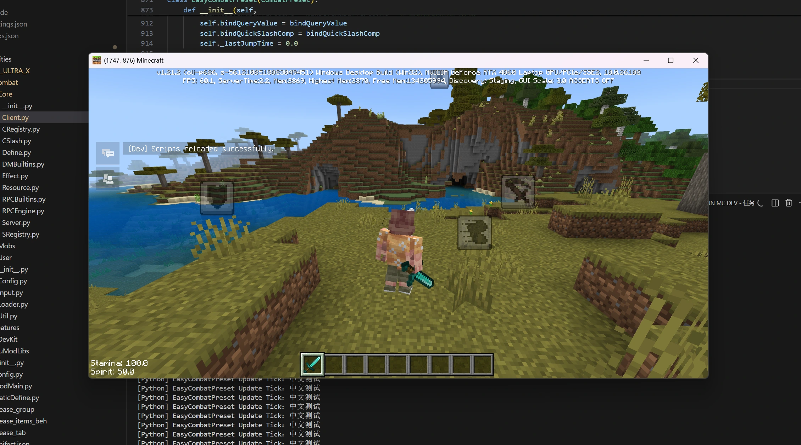

# MCDevTool
适用于**网易我的世界**的开发者工具包，提供创建测试世界、加载用户Mod等功能，方便开发者在脱离**mcs编辑器**的环境下离线测试Mod。



## 配置mcdk
您可以将**mcdk**添加到环境变量Path中，也可以直接放置在本地项目工作区以便命令搜索。

## 在vscode中使用
您可以在**vscode**中配置任务以便直接运行**mcdk**，例如：

```jsonc
// .vscode/tasks.json
// 可通过 Ctrl+Shift+B 快捷键执行
{
    "version": "2.0.0",
    "tasks": [
        {
            "label": "RUN MC DEV",
            "type": "shell",
            "command": "cmd /c mcdk",
            "group": {
                "kind": "build",
                "isDefault": true
            },
            "presentation": {
                "reveal": "always",
                "panel": "shared"
            },
            "problemMatcher": [
                {
                    "owner": "python",
                    "fileLocation": ["relative", "${workspaceFolder}"],
                    // 匹配Python异常堆栈信息(该规则可能不准确，仅供参考)
                    "pattern": [
                        {
                            "regexp": "  File \"(.*)\", line (\\d+), in .*",
                            "file": 1,
                            "line": 2
                        },
                        {
                            "regexp": "^(.*Error|.*Exception): (.*)$",
                            "message": 0
                        }
                    ]
                }
            ]
        }
    ]
}
```

## 在pycharm中使用
由于作者并不使用**pycharm**，以下数据来源于网络，仅供参考：
1. 点击菜单栏中的 `Run → Edit Configurations`
2. 打开`创建 Run Configuration`
3. 创建新的配置项
4. 配置`Shell Script`执行`mcdk`


## mcdev.json 配置参数
MCDEV配置文件，若不存在字段将以此处默认值为基准。
```jsonc
{
    // 首次运行将会自动生成 .mcdev.json 文件
    // 用于包含需要加载的MOD目录(默认值) 允许相对路径和绝对路径(相对路径以工作区为基准)
    "included_mod_dirs": [
        "./"
    ],
    // 指定游戏exe路径(string)
    "game_executable_path": "",
    // 生成的世界种子 若为null则随机生成(null / int)
    "world_seed": null,
    // 是否在启动时重置并新生成世界
    "reset_world": false,
    // 用于渲染的世界名称 (string)
    "world_name": "MC_DEV_WORLD",
    // 目录存档名(ASCII STRING)
    "world_folder_name": "MC_DEV_WORLD",
    // 是否自动进入游戏存档(实验性功能，尚未完善，需另行编译)
    "auto_join_game": true,
    // 是否附加调试MOD(boolean)，若启用将在生成的世界中包含热更新脚本(R键触发检测)并重定向输出流使其附加[Python]前缀可供筛选搜索。
    "include_debug_mod": true,
    // 生成的世界类型(0.旧版有限世界 1.无限世界 2.超平坦) (int)
    "world_type": 1,
    // 游戏模式(0.生存 1.创造 2.冒险) (int)
    "game_mode": 1,
    // 是否启用作弊(boolean)
    "enable_cheats": true,
    // 是否死亡不掉落(boolean)
    "keep_inventory": true
}
```

## 第三方依赖
| 库名 | 用途 | 备注 |
|-----|------|------|
| [nlohmann/json](https://github.com/nlohmann/json) | 处理 JSON 配置文件解析与生成 | Header-only |
| [NBT](https://github.com/GlacieTeam/NBT) | 用于构建 `level.dat` 等 NBT 格式文件 | 依赖 BinaryStream 和 Zlib |
| [BinaryStream](https://github.com/GlacieTeam/BinaryStream) | NBT 的底层二进制读写支持 | NBT 内部依赖 |
| [Zlib](https://zlib.net) | NBT 数据压缩与解压缩 | NBT 内部依赖 |
